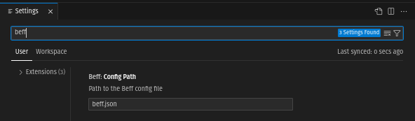

# VSCode Extension

## Installation

```bash
ext install beff.beff-vscode
```

[Or install from VSCode Marketplace](https://marketplace.visualstudio.com/items?itemName=beff.beff-vscode)

### Configuration

| Option          | Default   | Description                  |
| --------------- | --------- | ---------------------------- |
| beff.configPath | beff.json | Path to the Beff config file |


