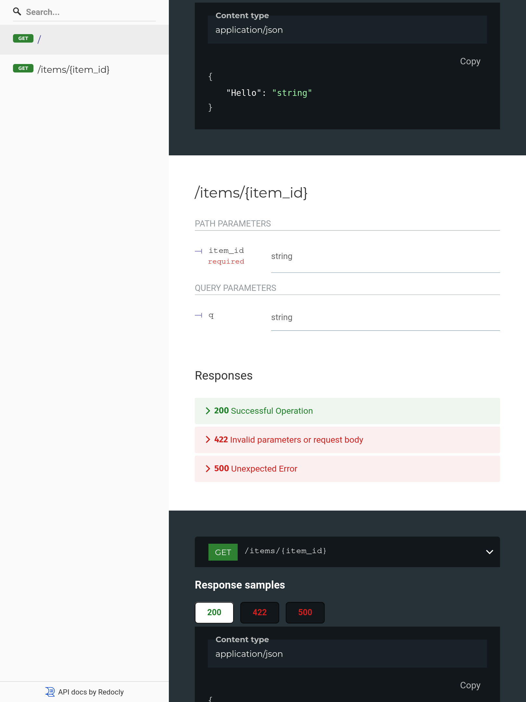

# Beff

> The power of TRpc and Zod, the simplicity of FastAPI. Powered by a compiler à la Tailwind.

## Development Environment Requirements

- Node 18+

## Installation

`npm install @beff/cli`

You will also need to install a runtime.

`npm install @beff/hono @hono/node-server`

## Example

### Create it

Create a file `beff.json` with:

```json title="/beff.json"
{
  "router": "./router.ts",
  "outputDir": "./generated"
}
```

Create a file `router.ts` with:

```ts title="/router.ts"
import { Ctx } from "@beff/hono";

export default {
  "/": {
    get: () => {
      return { Hello: "World" };
    },
  },
  "/items/{item_id}": {
    get: (c: Ctx, item_id: string, q?: string) => {
      return { item_id, q };
    },
  },
};
```

:::note

Type annotations are always required in the router. Beff makes it worth it, though. We'll get to it later.

:::

Create a file `index.ts` with:

```ts title="/index.ts"
import { serve } from "@hono/node-server";
import { buildHonoApp } from "@beff/hono";
import router from "./router";
import generated from "./generated/router";

const app = buildHonoApp({
  router,
  generated,
});
serve({
  fetch: app.fetch,
  port: 3040,
});

console.log(`Server running at http://localhost:3040/`);
console.log(`Check docs at at http://localhost:3040/docs`);
```

### Compile it

```bash
npx beff -p beff.json && \
npx esbuild index.ts --bundle --platform=node --target=node16 --outdir=dist
```

:::tip

You can also add a task in your package.json `"beff": "beff -p beff.json"` and use it with `npm run beff`.

:::

### Run it

```bash
node dist/index.js
```

### Check it

Open your browser at [http://127.0.0.1:3040/items/5?q=somequery](http://127.0.0.1:3040/items/5?q=somequery).

You will see the JSON response as:

```json
{ "item_id": 5, "q": "somequery" }
```

You already created an API that:

- Receives HTTP requests in the paths `/` and `/items/{item_id}`.
- Both paths take `GET` operations (also known as HTTP methods).
- The path `/items/{item_id}` has a path parameter `item_id` that should be an `int`.
- The path `/items/{item_id}` has an optional `str` query parameter `q`.

### Interactive API docs

Now go to [http://127.0.0.1:3040/docs](http://127.0.0.1:3040/docs).

You will see the automatic interactive API documentation (provided by [Swagger UI](https://github.com/swagger-api/swagger-ui)):


### Alternative API docs

And now, go to [http://127.0.0.1:3040/redoc](http://127.0.0.1:3040/redoc).

You will see the alternative automatic documentation (provided by [ReDoc](https://github.com/Rebilly/ReDoc)):



## Example upgrade

Now modify the `router.ts` to receive a body of a put request.

Declare the body using standard typescript types.

```ts title="/router.ts"
import { Ctx } from "@beff/hono";

// highlight-start
type Item = {
  name: string;
  price: number;
  is_offer?: boolean;
};
// highlight-end

export default {
  "/": {
    get: () => {
      return { Hello: "World" };
    },
  },
  "/items/{item_id}": {
    get: (c: Ctx, item_id: string, q?: string) => {
      return { item_id, q };
    },
    // highlight-start
    put: (c: Ctx, item_id: string, item: Item) => {
      return { item_id, item_name: item.name };
    },
    // highlight-end
  },
};
```
